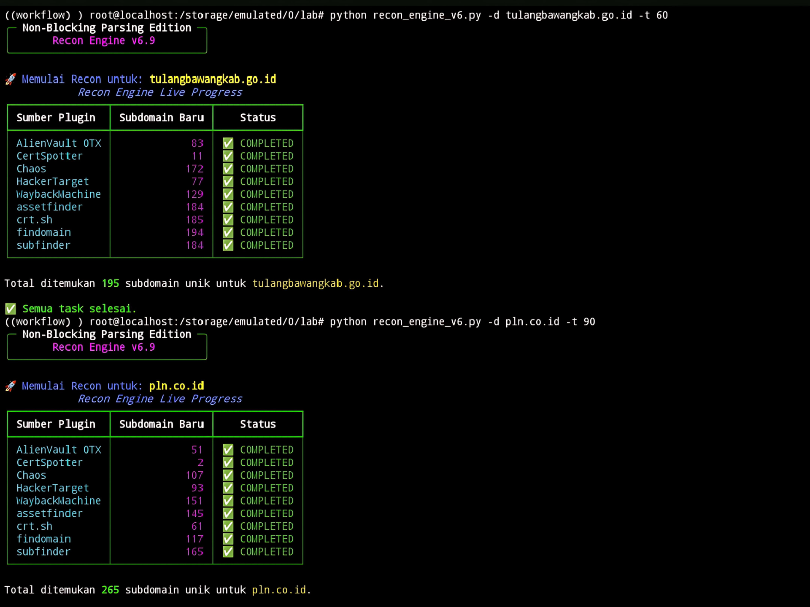

# Recon-Engine


<!-- Tambahkan badge CI jika sudah ada workflow -->

> **Recon-Engine** adalah framework modular dan asinkron untuk enumerasi subdomain, dirancang untuk bug bounty hunter, pentester, dan siapa saja yang membutuhkan proses reconnaissance domain yang cepat, fleksibel, dan extensible.

---

## 🚀 Fitur Utama

- **Modular & Extensible:** Mudah menambah plugin baru (API/tool eksternal) tanpa modifikasi core.
- **Asynchronous:** Semua task berjalan secara paralel untuk performa maksimal.
- **Live Progress CLI:** Tampilkan progress secara real-time di terminal.
- **Output Multi-format:** Dukungan output ke TXT, CSV, JSON, dan HTML.
- **Encrypted Caching:** Cache terenkripsi untuk hasil scanning dan API key.
- **Validasi Domain Otomatis:** Filter domain valid secara otomatis.
- **Plugin System:** Pilihan plugin API & tool populer siap pakai.

---

## 📦 Instalasi

### 1. Clone & Masuk Direktori

```bash
git clone https://github.com/haza-3301/Recon-Engine.git
cd Recon-Engine
```

### 2. Aktifkan Virtualenv (Opsional, Disarankan)

```bash
python3 -m venv venv
source venv/bin/activate
```

### 3. Install Awal

```bash
python install.py install
```

---

## 🏁 Langkah Kilat Pemakaian

```bash
# Contoh menjalankan Recon-Engine pada satu domain
python3 main.py -d example.com -t 60 -o hasil.txt

# Opsi lain:
#   -l domains.txt      # input dari file
#   --resolve-ip        # resolusi domain ke IP
#   --asn-lookup        # lookup ASN
#   -o hasil.json       # output format berbeda
```

---

## 🏗️ Arsitektur & Alur Kerja

```
Input → Loader Plugin → Eksekusi Async → Validasi & Resolusi → Output Writer → Laporan
```

Recon-Engine memproses input domain/daftar domain, memanggil plugin (API/tools), melakukan validasi & resolusi, lalu menulis output. Plugin bisa ditambahkan tanpa mengubah core engine.

---

## 🧩 Daftar Plugin Bawaan

| Plugin         | Tipe   | Sumber Data/API        | Deskripsi               |
|----------------|--------|------------------------|-------------------------|
| subfinder      | Tools  | ProjectDiscovery       | Subdomain enumeration   |
| crtsh          | API    | crt.sh                 | Certificate transparency|
| dnsdumpster    | API    | dnsdumpster.com        | DNS reconnaissance     |
| ...            | ...    | ...                    | ...                     |

> Lihat folder `plugins/` untuk daftar plugin lengkap dan cara menambah plugin baru.

---

## ⚙️ Cara Menambah Plugin

1. Buat file plugin di folder `plugins/` (lihat contoh di `plugins/`).
2. Implementasikan class sesuai template plugin.
3. Daftarkan plugin pada `plugins/__init__.py` jika perlu.
4. Jalankan ulang Recon-Engine.

---

## 📥 Contoh Output

### Output Recon-Engine


### Output JSON
```json
[
  {
    "domain": "sub.example.com",
    "ip": "1.2.3.4",
    "source": "crtsh"
  }
]
```

---

## ❓ FAQ

**Q: Kenapa hasil scan kosong?**  
A: Pastikan koneksi internet stabil & plugin aktif.

**Q: Error saat install dependensi?**  
A: Gunakan Python 3.8+, upgrade pip ke versi terbaru.

**Q: Bagaimana menambah plugin baru?**  
A: Lihat panduan “Cara Menambah Plugin” di atas.

---

## 📑 Dokumentasi Lengkap

- [Dokumentasi Plugin](docs/plugins.md)
- [API Reference](docs/api.md)
- [Changelog](https://github.com/haza-3301/Recon-Engine/commits/main)

---

## 🤝 Kontribusi

Kontribusi sangat terbuka!  
1. Fork repo ini.
2. Buat branch baru untuk fitur/bug.
3. Pull request dengan detail perubahan.

Baca [CONTRIBUTING.md](CONTRIBUTING.md) untuk panduan kontribusi lebih lanjut.

---

## 👥 Kontributor

| Nama      | Github ID    |
|-----------|--------------|
| haza-3301 | @haza-3301   |
| ...       | ...          |

---

## 📫 Kontak & Dukungan

- Diskusi & pertanyaan: [GitHub Discussions](https://github.com/haza-3301/Recon-Engine/discussions)
- Laporkan bug: [Issues](https://github.com/haza-3301/Recon-Engine/issues)
- Email: your@email.com

---

## ⚠️ Lisensi

MIT License. Lihat [LICENSE](LICENSE) untuk detail.

---
